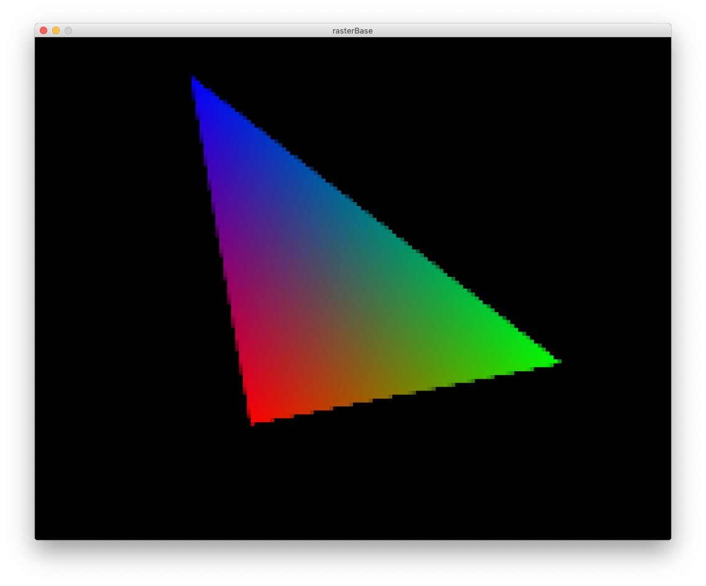

# Taller raster

## Propósito

Comprender algunos aspectos fundamentales del paradigma de rasterización.

## Tareas

Emplee coordenadas baricéntricas para:

1. Rasterizar un triángulo; y,
2. Sombrear su superficie a partir de los colores de sus vértices.

Referencias:

* [The barycentric conspiracy](https://fgiesen.wordpress.com/2013/02/06/the-barycentric-conspirac/)
* [Rasterization stage](https://www.scratchapixel.com/lessons/3d-basic-rendering/rasterization-practical-implementation/rasterization-stage)

Opcionales:

1. Implementar un [algoritmo de anti-aliasing](https://www.scratchapixel.com/lessons/3d-basic-rendering/rasterization-practical-implementation/rasterization-practical-implementation) para sus aristas; y,
2. Sombrear su superficie mediante su [mapa de profundidad](https://en.wikipedia.org/wiki/Depth_map).

Implemente la función ```triangleRaster()``` del sketch adjunto para tal efecto, requiere la librería [frames](https://github.com/VisualComputing/frames/releases).

## Integrantes

Dos, o máximo tres si van a realizar al menos un opcional.

Complete la tabla:

| Integrante | github nick |
|------------|-------------|
|Miguel Ángel Tovar Onofre | [MikeAngelo007](https://github.com/MikeAngelo007) |
|Yeliana Andrea Torres Medina | [Yelis3](https://github.com/Yelis3)|
|José Daniel Cifuentes Guarnizo | [jdcifuentes](https://github.com/jdcifuentes)|

## Discusión

Se logró la implementación de la función *triangleRaster* usando la función edgeFunction.

> (cx - ax) * (by - ay) - (cy - ay) * (bx - ax)

Haciendo uso de las coordenadas baricéntricas.

En el shading, se usa la función que calcula los valores RGB (intensidad) para cada píxel dependiendo de la distancia a los vértices y el valor de anti-aliasing aplicado.

También se aplica un algoritmo de anti-aliasing, este divide el pixel en sub-regiones (4, 8, 16) y luego toma el promedio de los pixeles que estan dentro de la figura y se asigna la intensidad del color, con este se logra mejorar la representación rasterizada del triangulo. Oprimiendo la tecla i se logra cambiar el valor del el anti-aliasing.





## Entrega

* Modo de entrega: [Fork](https://help.github.com/articles/fork-a-repo/) la plantilla en las cuentas de los integrantes.
* Plazo: 30/9/18 a las 24h.
